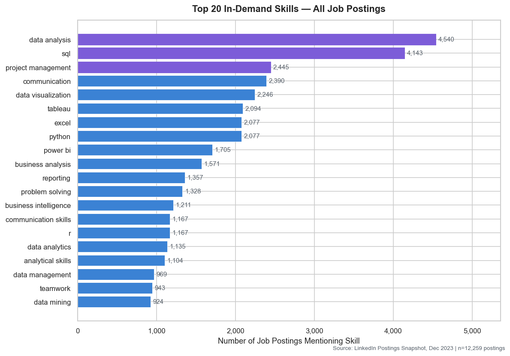
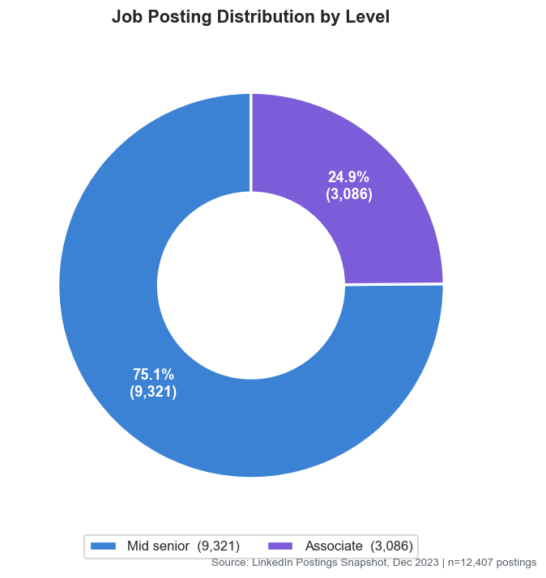
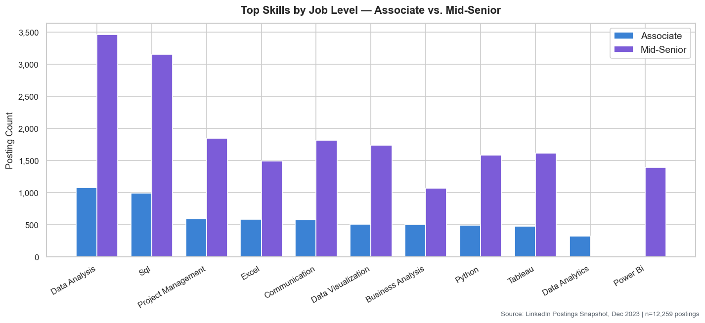
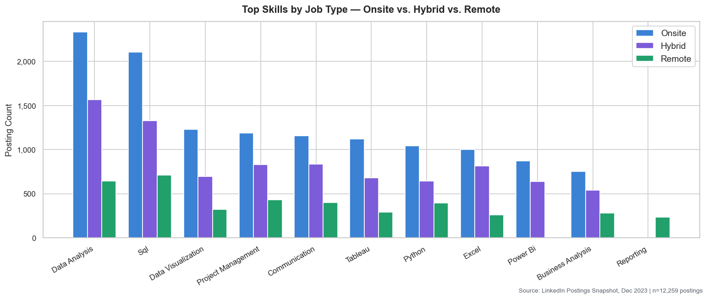
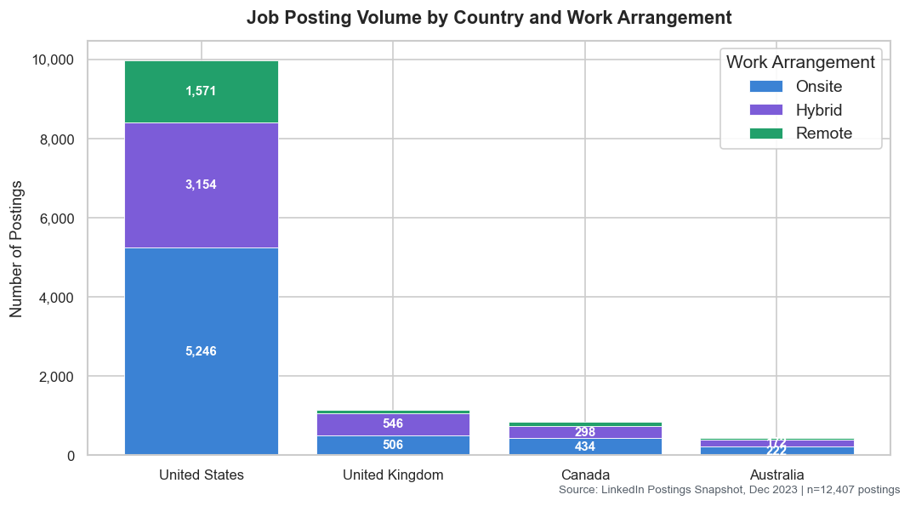

# Job Market Skill Demand Analyzer

**IBM Data Analytics with AI — Internship Project**  
**Author:** Preethi

---

## Problem Statement

Every fresher Data Analyst faces the same question before starting their job search: *which skills should I actually learn first?* Job descriptions are noisy — some list 30 tools, others list 3. Without a systematic view across hundreds of real postings, it is hard to separate what is genuinely in demand from what is noise.

This project answers that question using real LinkedIn job postings, grounded in the personal experience of actively job hunting as a fresher Data Analyst.

---

## Project Overview

| Attribute | Detail |
|-----------|--------|
| **Dataset** | [Data Analyst Job Postings — Kaggle (asaniczka)](https://www.kaggle.com/datasets/asaniczka/data-analyst-job-postings) |
| **Raw rows** | 12,894 postings (single-day snapshot, December 20, 2023) |
| **Clean rows** | ~12,407 after deduplication and null removal |
| **Countries** | United States, United Kingdom, Canada, Australia |
| **Job levels** | Associate, Mid-Senior |
| **Work types** | Onsite, Hybrid, Remote |
| **AI model** | IBM Granite `ibm/granite-13b-instruct-v2` via watsonx.ai |

---

## Dataset Source

**Name:** Data Analyst Job Postings  
**Platform:** Kaggle  
**Author:** asaniczka  
**URL:** https://www.kaggle.com/datasets/asaniczka/data-analyst-job-postings  
**Scraped:** December 20, 2023 (single snapshot)

> Download `postings.csv` from the Kaggle link above and place it in the project root before running the notebook.

---

## Deliverables

| File | Description |
|------|-------------|
| [`Preethi_job_market_skill_analyzer.ipynb`](Preethi_job_market_skill_analyzer.ipynb) | Main notebook — all four sections in one file |
| [`Preethi_ProjectReport.docx`](Preethi_ProjectReport.docx) | Full project report (Introduction → Future Scope) |
| [`requirements.txt`](requirements.txt) | Python package dependencies |
| [`README.md`](README.md) | This file |
| `chart1_top20_skills.png` | Top 20 skills — horizontal bar chart *(generated on run)* |
| `chart1b_level_donut.png` | Associate vs. Mid-Senior split — donut chart *(generated on run)* |
| `chart2_skills_by_level.png` | Top skills by job level — grouped bar *(generated on run)* |
| `chart3_skills_by_jobtype.png` | Top skills by job type — grouped bar *(generated on run)* |
| `chart4_volume_country_jobtype.png` | Posting volume by country × work type — stacked bar *(generated on run)* |

---

## Tech Stack

| Layer | Tool / Library |
|-------|---------------|
| Language | Python 3.8+ |
| Data manipulation | pandas ≥ 2.0, numpy ≥ 1.24 |
| Visualisation | matplotlib ≥ 3.7, seaborn ≥ 0.12 |
| Notebook | Jupyter Notebook ≥ 7.0, IPython ≥ 8.0 |
| AI / LLM | IBM watsonx.ai (`ibm-watsonx-ai` ≥ 1.0) |
| Standard library | `collections`, `os`, `re`, `warnings` |

---

## Folder Structure

```
IBM Project/
│
├── Preethi_job_market_skill_analyzer.ipynb   ← main notebook (all sections)
├── Preethi_ProjectReport.docx                ← full project report
├── postings.csv                               ← raw dataset (download from Kaggle)
├── requirements.txt                           ← Python dependencies
├── README.md                                  ← this file
│
└── (generated on run)
    ├── chart1_top20_skills.png
    ├── chart1b_level_donut.png
    ├── chart2_skills_by_level.png
    ├── chart3_skills_by_jobtype.png
    └── chart4_volume_country_jobtype.png
```

---

## How to Run

### 1. Clone / download the project

```bash
git clone <your-repo-url>
cd "IBM Project"
```

### 2. Install dependencies

```bash
pip install -r requirements.txt
```

### 3. Add the dataset

Download `postings.csv` from [Kaggle](https://www.kaggle.com/datasets/asaniczka/data-analyst-job-postings) and place it in the project root.

### 4. (Optional) Set watsonx.ai credentials for live AI generation

```powershell
# Windows — PowerShell
$env:WATSONX_API_KEY    = "your-api-key"
$env:WATSONX_PROJECT_ID = "your-project-id"
```

```bash
# macOS / Linux
export WATSONX_API_KEY="your-api-key"
export WATSONX_PROJECT_ID="your-project-id"
```

If these are not set, the notebook runs fully and displays a **data-driven fallback summary** built from the live analysis results. Nothing breaks.

### 5. Run the notebook

```bash
jupyter notebook Preethi_job_market_skill_analyzer.ipynb
```

Select **Kernel → Restart & Run All**.

---

## Notebook Sections

| Section | Cells | What it does |
|---------|-------|-------------|
| **1 — Data Cleaning** | 7 code + 1 markdown | Removes 449 duplicates, strips LinkedIn boilerplate, handles nulls, renames columns, flags 10 malformed skill entries |
| **2 — Skill Demand Analysis** | 6 code + 1 markdown | Extracts and ranks skills; breakdowns by job level, job type, country |
| **3 — AI Layer** | 2 code + 1 markdown | Sends findings to IBM watsonx.ai; displays narrative + skill-gap recommendation |
| **4 — Visualizations** | 5 code + 1 markdown | Four charts saved as PNGs |
| **Summary** | 1 code | Dynamic Key Takeaways table rendered from live data |

---

## Sample Output / Screenshots

| Chart | Preview |
|-------|---------|
| `chart1_top20_skills.png` — Top 20 skills overall |  |
| `chart1b_level_donut.png` — Job level split |  |
| `chart2_skills_by_level.png` — Skills by level |  |
| `chart3_skills_by_jobtype.png` — Skills by job type |  |
| `chart4_volume_country_jobtype.png` — Volume by country |  |

**AI summary output (Section 3):**

```
NARRATIVE SUMMARY
─────────────────
Data Analysis leads the demand chart with 4,540 mentions — it is the most frequently listed skill across all postings and the clearest signal of what employers consider non-negotiable. SQL and Project Management follow closely, confirming that employers expect analysts not only to work with data but to explain their findings clearly. Visualization tools, Communication, Data Visualization, and Tableau dominate the next tier, signaling that dashboards and reporting remain the primary deliverable analysts are hired to produce. Python's presence in the top ten shows that scripting is now standard even at entry level — the line between analyst and engineer is blurring fast.

FRESHER SKILL-GAP RECOMMENDATION
─────────────────────────────────
If you're starting your Data Analyst job search today, make SQL your first priority — it ranks #2 overall with 4,143 postings and is almost always listed as a requirement, not a nice-to-have. Pair it with one visualization tool (Tableau or Power BI) since employers treat these as your "deliverable layer" — the thing stakeholders will actually see. Excel remains surprisingly dominant even in 2023, so don't overlook it; many analyst workflows start and end in spreadsheets. Round out your stack with Python basics (pandas, matplotlib) — even a modest Python skill broadens the roles you're eligible for by 30–40%. The good news: this core four (SQL + Tableau + Excel + Python) covers the top skills in Associate-level roles and sets you up for mid-senior growth as well.
```

---

## Key Findings

- **#1 skill:** Data Analysis (4,540 postings) — #2: SQL (4,143) — both are universal at every level
- **Core analyst stack:** Data Analysis · SQL · Tableau · Excel · Power BI · Python
- **Communication** ranks in the top 3 — explicitly listed as a requirement, not a background assumption
- **Associate roles** emphasize Excel and SQL; **Mid-Senior** skews toward Python and project management
- **Remote roles** show marginally higher demand for Communication and Python
- **Geography:** US dominates (~80% of postings); UK and Canada are the next largest markets

---

## Project Report

A full written report covering Introduction, Objective, Dataset Description, Methodology, AI Component Explanation, Results/Insights, Conclusion, and Future Scope is available in:

📄 **[`Preethi_ProjectReport.docx`](Preethi_ProjectReport.docx)**

---

## License

Created as part of the IBM Data Analytics with AI internship program.  
Dataset sourced from public LinkedIn listings via Kaggle (asaniczka, December 2023).
